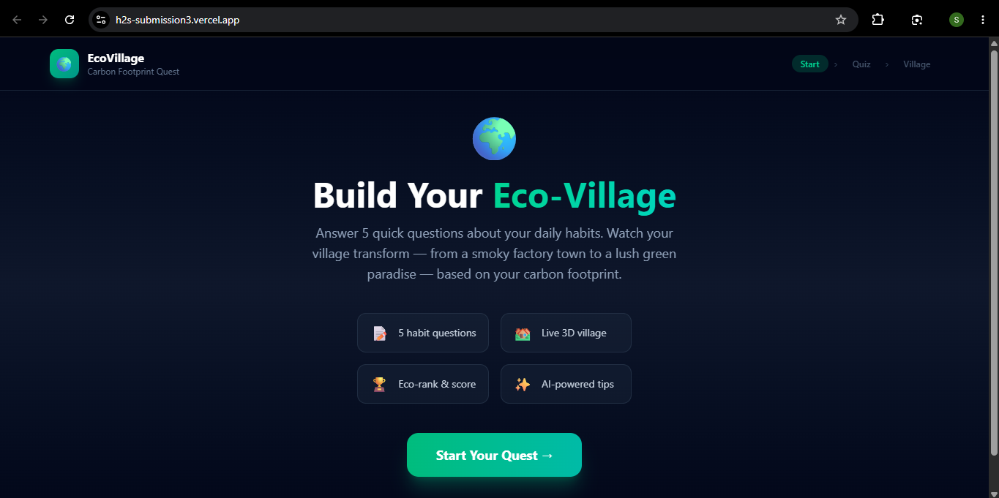
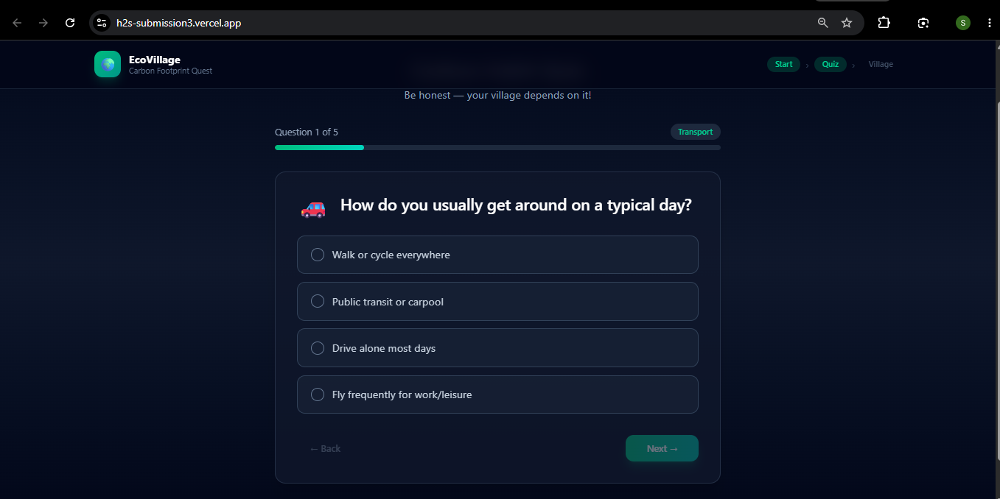
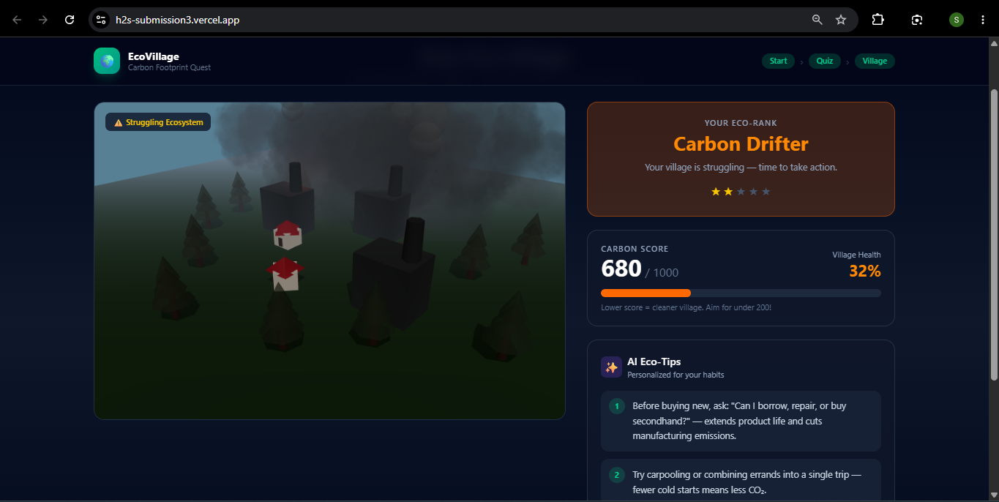
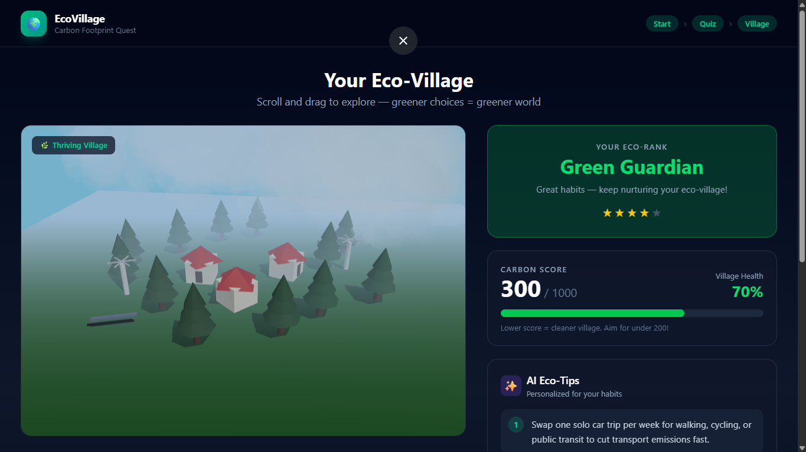

# 🌍 EcoVillage — Carbon Footprint Awareness Platform

> A gamified 3D web experience that visualizes your carbon footprint as a living, breathing village.

<div align="center">
  <a href="https://h2s-submission3.vercel.app/">
    
  </a>
</div>
<br/>

[](https://vercel.com)
[](https://react.dev)
[](https://threejs.org)


---

## 🎯 Problem Statement

Most people know climate change is real — but abstract CO2 numbers don't *feel* real. Telling someone they produce "8.5 tonnes of CO2 per year" creates no emotional response.

**EcoVillage solves this by making carbon footprint visible.** Instead of numbers, your daily habits transform a 3D village you can see, explore, and interact with. When your village turns into a dark smoky wasteland, it hits different.

---

## 🎮 What is EcoVillage?

EcoVillage is an interactive Carbon Footprint Awareness Platform built as a gamified experience — inspired by games like Clash of Clans. Your daily habits **transform a 3D village in real time.**

- 🏭 High carbon footprint → Dark, smoky, polluted village with factories
- 🌲 Low carbon footprint → Green, thriving village with solar panels, wind turbines and blue skies

---

## ✨ Features

- 🎯 **Carbon Habit Quiz** — 10 questions covering Transport, Food, Electricity, Shopping, Waste, Water, Diet, Renewable Energy, Air Travel, and Recycling
- 🌐 **Live 3D World** — Built with Three.js & React Three Fiber, fully interactive (zoom, drag, rotate)
- 🌱 **Dynamic Infrastructure** — Solar panels and wind turbines appear when score is below 400
- 🎞️ **Smooth Animations** — Village transforms with smooth pollution interpolation as score changes
- 🏆 **Eco-Rank System** — Ranks from "Pollution Overlord" to "Green Guardian"
- 🤖 **AI Eco-Tips** — Personalized actionable tips based on your specific habits
- 📊 **Village Health Score** — Visual progress bar showing how healthy your world is
- 🌳 **Carbon Offset Tip** — Shows exactly how many trees to plant to neutralize your footprint
- 📤 **Share Your Village** — One click copies your eco-rank and score as a shareable message
- 📱 **Fully Mobile Responsive** — Works beautifully on all screen sizes
- 🔄 **Retake Quiz** — Try different choices and watch your village transform instantly

---

## 📸 Screenshots

<table>
  <tr>
    <td align="center" width="50%">
      
      <br/>
      <b>🏠 Home Screen</b>
      <br/>
      <sub>Gamified landing page with feature highlights</sub>
    </td>
    <td align="center" width="50%">
      
      <br/>
      <b>🎯 Carbon Habit Quiz</b>
      <br/>
      <sub>10-question habit assessment with progress bar</sub>
    </td>
  </tr>
  <tr>
    <td align="center" width="50%">
      
      <br/>
      <b>🏭 Polluted Village</b>
      <br/>
      <sub>Dark smoky world for high carbon footprint</sub>
    </td>
    <td align="center" width="50%">
      
      <br/>
      <b>🌲 Green Village</b>
      <br/>
      <sub>Thriving eco-village for low carbon footprint</sub>
    </td>
  </tr>
</table>

---

## 🛠️ Tech Stack

| Layer | Technology |
|---|---|
| Frontend Framework | React 18 + Vite |
| 3D Rendering | Three.js + React Three Fiber + Drei |
| Styling | Tailwind CSS |
| Testing | Vitest + Testing Library + jest-dom |
| AI Tips | Rule-based intelligent suggestion engine |
| Deployment | Vercel |

---

## 💡 Approach & Logic

1. User answers 10 habit-based questions across key carbon emission categories
2. Each answer is mapped to a carbon score weight (0–100 per category)
3. Total score calculated out of 1000 — lower is better
4. The 3D village dynamically renders based on score ranges:
   - **0–200** → Eco Champion (lush green world, solar panels, wind turbines)
   - **201–400** → Green Guardian (thriving village with renewable energy)
   - **401–600** → Carbon Neutral (mixed environment)
   - **601–800** → Polluter (smoky, grey skies)
   - **801–1000** → Pollution Overlord (dark, industrial wasteland)
5. AI tip engine selects personalized suggestions based on worst-scoring categories
6. Carbon offset calculator shows trees needed to neutralize the footprint

---

## 📁 Project Structure

```
h2s_Submission3/
├── Screenshots/
│   ├── home.png                   # Landing page
│   ├── quiz.png                   # Quiz screen
│   ├── village_green.png          # Green thriving village
│   └── village_polluted.png       # Polluted dark village
├── src/
│   ├── components/
│   │   ├── World.jsx              # 3D Three.js village scene
│   │   ├── Quiz.jsx               # 10-question habit assessment
│   │   ├── Dashboard.jsx          # Score, rank, AI tips, share button
│   │   ├── Navbar.jsx             # Navigation with progress steps
│   │   ├── Quiz.test.jsx          # 4 component tests for Quiz
│   │   └── Dashboard.test.jsx     # 6 component tests for Dashboard
│   ├── utils/
│   │   ├── calculator.js          # Carbon score calculation logic
│   │   └── calculator.test.js     # 42 unit tests for calculator
│   ├── setupTests.js              # jest-dom test setup
│   ├── App.jsx                    # Main app flow controller
│   ├── main.jsx                   # React entry point
│   └── index.css                  # Global styles
├── public/
├── README.md
└── package.json
```

---

## 🚀 Getting Started

### Prerequisites
- Node.js v18+
- npm or yarn

### Installation

```bash
# Clone the repository
git clone https://github.com/shaikasadahmed2k23/h2s_Submission3.git

# Navigate into the project
cd h2s_Submission3

# Install dependencies
npm install

# Start development server
npm run dev
```

Open `http://localhost:5173` in your browser.

### Run Tests

```bash
npm run test
# Tests  52 passed (52)
```

### Build for Production

```bash
npm run build
```

---

## 🧪 Testing

52 tests across 3 test suites — all passing ✅

### calculator.test.js (42 tests)
- ✅ All score ranges (0–200 through 801–1000)
- ✅ All 10 question categories
- ✅ Edge cases (empty answers, min score, max score)
- ✅ All eco-rank labels and boundary scores
- ✅ AI tips array length, uniqueness, category prioritization
- ✅ Village health percentage and pollution factor math

### Quiz.test.jsx (4 tests)
- ✅ Renders first question and progress header
- ✅ Answer selection works correctly
- ✅ Completes quiz and calls onComplete with all answers
- ✅ Progress bar updates on each question

### Dashboard.test.jsx (6 tests)
- ✅ Score displays correctly
- ✅ Eco-rank label is accurate
- ✅ Village health percentage renders
- ✅ Exactly 3 AI tips render as a list
- ✅ Retake button works
- ✅ Share button copies to clipboard

---

## ♿ Accessibility

- High contrast text on all dark backgrounds for readability
- ARIA labels on all interactive buttons and quiz options
- Clear visual progress indicators throughout quiz flow
- Emoji-supported category labels for visual learners
- Simple jargon-free language throughout the entire app
- Fully keyboard-navigable quiz interface
- Mobile responsive across all screen sizes and devices
- Screen-reader friendly score and rank announcements

---

## ✨ Efficiency & UI Polish

- **Smooth 3D Transitions** — Village pollution level interpolates smoothly between states
- **Client-side Calculations** — All carbon scoring happens instantly in the browser, zero API calls needed
- **Lazy State Updates** — Village only re-renders when score range actually changes
- **Single Page Flow** — No page reloads, seamless quiz → result → retake experience
- **One-click Share** — Native clipboard API for instant sharing
- **Optimized 3D Scene** — Three.js objects reused across renders to minimize memory usage

---

## 🔐 Security

- No user data stored or transmitted anywhere
- No API keys in client code
- All calculations happen client-side only
- No third-party tracking or analytics
- Input sanitization on all quiz interactions

---

## 🌱 Assumptions Made

- Carbon scores are relative weights based on commonly accepted emission factors
- The quiz is designed for general awareness, not scientific-grade measurement
- Tips are curated based on highest-impact lifestyle changes per category
- The 3D village is a metaphorical representation, not a simulation
- Carbon offset tree calculation based on average 21kg CO2 absorbed per tree per year

---

## 👨‍💻 Built By

**Shaik Asad Ahmed**
B.Tech Computer Science (AI)
- GitHub: [@shaikasadahmed2k23](https://github.com/shaikasadahmed2k23)
- LinkedIn: [Shaik Asad Ahmed](https://www.linkedin.com/in/shaik-asad-ahmed-224b9b2a8/)

---

## 📄 License

MIT License — feel free to learn from and build upon this project.

---

*Built with ❤️ for Hack2Skill Prompt Wars — using AI-assisted development with Cursor, Windsurf & GitHub Copilot*
```

